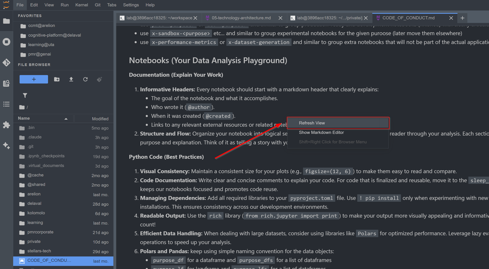

# JupyterLab Refresh View Extension


[](https://www.npmjs.com/package/jupyterlab_refresh_view_extension)
[](https://pypi.org/project/jupyterlab-refresh-view-extension/)
[](https://pepy.tech/project/jupyterlab-refresh-view-extension)

[](https://kolomolo.com)
[](https://www.paypal.com/donate/?hosted_button_id=B4KPBJDLLXTSA)

JupyterLab extension that adds a **"Refresh View"** context menu command to reload file content from disk while preserving scroll position.



## Features

The extension provides intelligent content refresh while preserving your exact position in the document. For notebooks, it identifies the visible cell in your viewport and automatically scrolls back to that cell after refresh, restoring both the cell position and viewport offset even when JupyterLab's windowed rendering progressively loads cells. For markdown and text files, it maintains precise scroll coordinates. The extension works seamlessly with [jupyterlab_tabular_data_viewer_extension](https://github.com/stellarshenson/jupyterlab_tabular_data_viewer_extension) to refresh CSV and tabular data files in their custom viewer.

- **Automatic Cell Scrolling** - Identifies visible notebook cell before refresh and automatically scrolls back to it afterward, preserving exact viewport position
- **Hybrid Position Tracking** - Cell-based anchoring for notebooks with scroll coordinate fallback, ensuring position preservation regardless of content loading order
- **Intelligent Stabilization** - Monitors content loading and adaptively restores position as cells render, stabilizing within 300ms typically
- **Tabular Data Viewer Compatibility** - Works with jupyterlab_tabular_data_viewer_extension to refresh CSV files in custom tabular view
- **Context Menu Integration** - Right-click access for markdown files, notebooks, text editors, and tabular data viewers
- **Command Palette Access** - Available under "File Operations" category
- **Smart Enable/Disable** - Only active when a document with reloadable context is open

## Use Cases

- **Iterative Editing** - Refresh files edited externally without losing your place
- **Live Documentation** - Keep markdown files in sync with external updates
- **Collaborative Work** - View changes from teammates without manual reload
- **Build System Integration** - Refresh generated files after build processes

## Requirements

- JupyterLab >= 4.0.0

## Installation

### From PyPI

```bash
pip install jupyterlab-refresh-view-extension
```

### From npm

```bash
jupyter labextension install jupyterlab_refresh_view_extension
```

## Usage

1. Open a markdown file, notebook, or text file in JupyterLab
2. Right-click anywhere in the document content
3. Select **"Refresh View"** from the context menu
4. The file reloads from disk while maintaining your scroll position

Alternatively, open the command palette (`Ctrl+Shift+C` or `Cmd+Shift+C`) and search for "Refresh View".

## Uninstall

```bash
pip uninstall jupyterlab-refresh-view-extension
```

## Contributing

### Development install

Note: You will need NodeJS to build the extension package.

The `jlpm` command is JupyterLab's pinned version of
[yarn](https://yarnpkg.com/) that is installed with JupyterLab. You may use
`yarn` or `npm` in lieu of `jlpm` below.

```bash
# Clone the repo to your local environment
# Change directory to the jupyterlab_refresh_view_extension directory
# Install package in development mode
pip install -e "."
# Link your development version of the extension with JupyterLab
jupyter labextension develop . --overwrite
# Rebuild extension Typescript source after making changes
jlpm build
```

You can watch the source directory and run JupyterLab at the same time in different terminals to watch for changes in the extension's source and automatically rebuild the extension.

```bash
# Watch the source directory in one terminal, automatically rebuilding when needed
jlpm watch
# Run JupyterLab in another terminal
jupyter lab
```

With the watch command running, every saved change will immediately be built locally and available in your running JupyterLab. Refresh JupyterLab to load the change in your browser (you may need to wait several seconds for the extension to be rebuilt).

By default, the `jlpm build` command generates the source maps for this extension to make it easier to debug using the browser dev tools. To also generate source maps for the JupyterLab core extensions, you can run the following command:

```bash
jupyter lab build --minimize=False
```

### Development uninstall

```bash
pip uninstall jupyterlab_refresh_view_extension
```

In development mode, you will also need to remove the symlink created by `jupyter labextension develop`
command. To find its location, you can run `jupyter labextension list` to figure out where the `labextensions`
folder is located. Then you can remove the symlink named `jupyterlab_refresh_view_extension` within that folder.

### Testing the extension

#### Frontend tests

This extension is using [Jest](https://jestjs.io/) for JavaScript code testing.

To execute them, execute:

```sh
jlpm
jlpm test
```

#### Integration tests

This extension uses [Playwright](https://playwright.dev/docs/intro) for the integration tests (aka user level tests).
More precisely, the JupyterLab helper [Galata](https://github.com/jupyterlab/jupyterlab/tree/master/galata) is used to handle testing the extension in JupyterLab.

More information are provided within the [ui-tests](./ui-tests/README.md) README.

### Packaging the extension

See [RELEASE](RELEASE.md)
